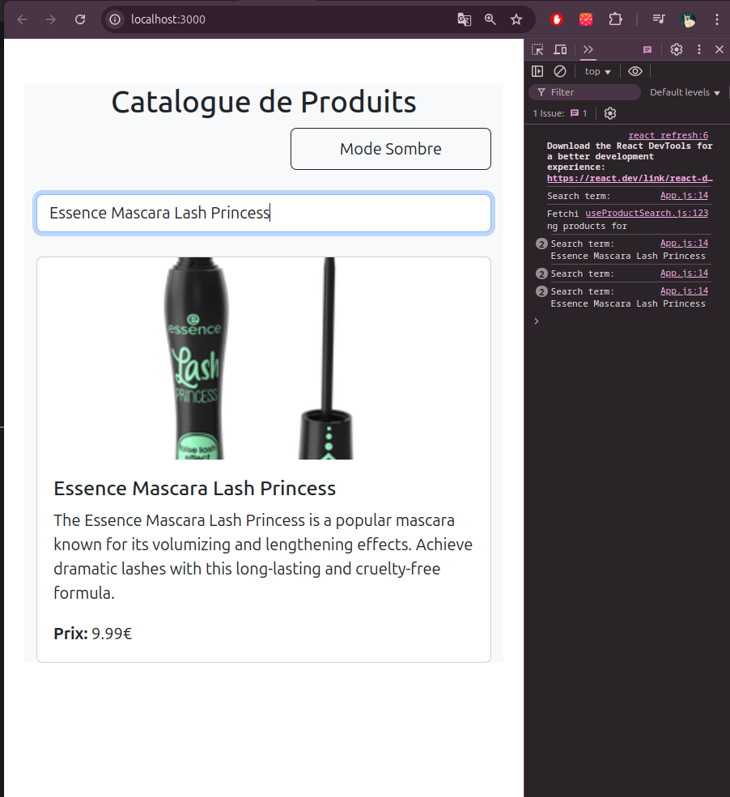

# TP React Hooks - Application de Gestion de Produits

Ce TP a pour objectif de mettre en pratique l'utilisation des Hooks React (useState, useEffect, useContext) ainsi que la création de Hooks personnalisés.

## Installation et configuration initiale

1. Cloner le dépôt :
```bash
git clone https://github.com/pr-daaif/tp-react-hooks.git
cd tp-react-hooks
```

2. Créer votre propre dépôt sur Github et changer le remote :
```bash
# Supprimer le remote origine
git remote remove origin

# Ajouter votre nouveau remote
git remote add origin https://github.com/[votre-username]/tp-react-hooks.git

# Premier push
git push -u origin main
```

3. Installer les dépendances :
```bash
npm install
```

4. Lancer l'application :
```bash
npm start
```

## Instructions pour le TP

Pour chaque exercice :
1. Lisez attentivement l'énoncé
2. Implémentez la solution
3. Testez votre implémentation (pensez à faire des copies d'écran)
4. Mettez à jour la section correspondante dans ce README avec :
   - Une brève explication de votre solution
   - Des captures d'écran montrant le fonctionnement
   - Les difficultés rencontrées et comment vous les avez résolues
5. Commitez vos changements avec un message descriptif

### Exercice 1 : État et Effets 
#### Objectif : Implémenter une recherche en temps réel

- [ ] 1.1 Modifier le composant ProductSearch pour utiliser la recherche
- [ ] 1.2 Implémenter le debounce sur la recherche
- [ ] 1.3 Documenter votre solution ici

_Votre réponse pour l'exercice 1 :_
```
Expliquez votre solution ici
La solution filtre les produits par title en fonction du searchTerm avant de les afficher. La comparaison est insensible à la casse pour améliorer la recherche. 
useDebounce est utilisé pour limiter le nombre de requêtes API en attendant que l'utilisateur ait fini de taper, améliorant ainsi les performances et évitant des appels inutiles.
[Ajoutez vos captures d'écran]




```

### Exercice 2 : Context et Internationalisation
#### Objectif : Gérer les préférences de langue

- [ ] 2.1 Créer le LanguageContext
- [ ] 2.2 Ajouter le sélecteur de langue
- [ ] 2.3 Documenter votre solution ici

_Votre réponse pour l'exercice 2 :_
```
Cette solution est bonne pour les traductions car elle sépare les paramètres de langue et de thème, ce qui facilite leur gestion. L'utilisation de LanguageProvider et LanguageSelector permet de gérer les traductions de manière propre sans compliquer les autres parties de l'application.
```


### Exercice 3 : Hooks Personnalisés
#### Objectif : Créer des hooks réutilisables

- [ ] 3.1 Créer le hook useDebounce
- [ ] 3.2 Créer le hook useLocalStorage
- [ ] 3.3 Documenter votre solution ici

_Votre réponse pour l'exercice 3 :_

```
useDebounce aide à gérer les performances en contrôlant quand appliquer les changements, basé sur un délai après que l'utilisateur ait cessé d'interagir.
Le hook useLocalStorage est utilisé pour enregistrer et récupérer des données dans le localStorage du navigateur. Cela permet de conserver des informations même après un rechargement de la page.
useLocalStorage permet de stocker une valeur dans le localStorage du navigateur et de la récupérer même après le rechargement de la page. le cas de search
Expliquez votre solution ici
[Ajoutez vos captures d'écran]
```


### Exercice 4 : Gestion Asynchrone et Pagination
#### Objectif : Gérer le chargement et la pagination

- [ ] 4.1 Ajouter le bouton de rechargement
- [ ] 4.2 Implémenter la pagination
- [ ] 4.3 Documenter votre solution ici

_Votre réponse pour l'exercice 4 :_
```
Expliquez votre solution ici
 la pagination pour diviser les produits en plusieurs pages et ajoute un bouton de rechargement pour actualiser la liste des produits. Elle utilise aussi les contextes de thème et de langue pour adapter l'affichage en fonction des préférences de l'utilisateur.
 
[Ajoutez vos captures d'écran]
```

## Rendu

- Ajoutez l'URL de votre dépôt Github dans  **Classroom** et envoyer la réponse dès le démarage de votre projet.
- Les push doivent se faire au fûr et à mesure que vous avancez dans votre projet.
- Le README.md doit être à jour avec vos réponses et captures d'écran. 
- Chaques exercice doit faire l'objet d'au moins un commit avec un message mentionnant le numéro de l'exercice.